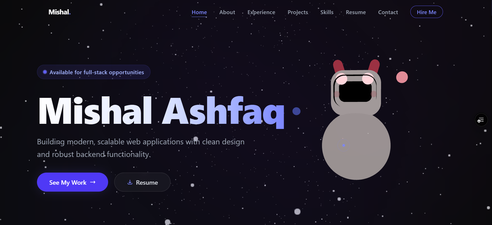
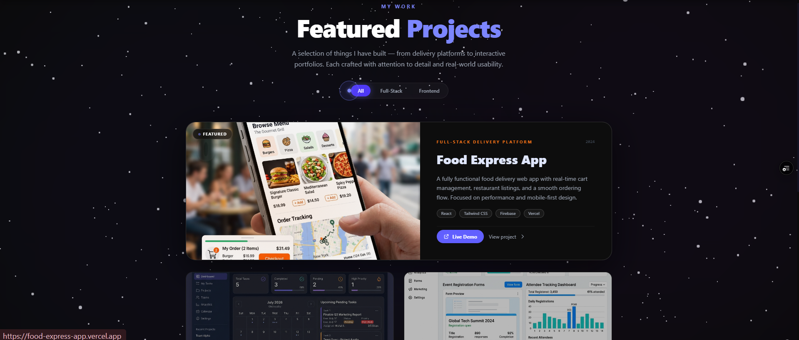
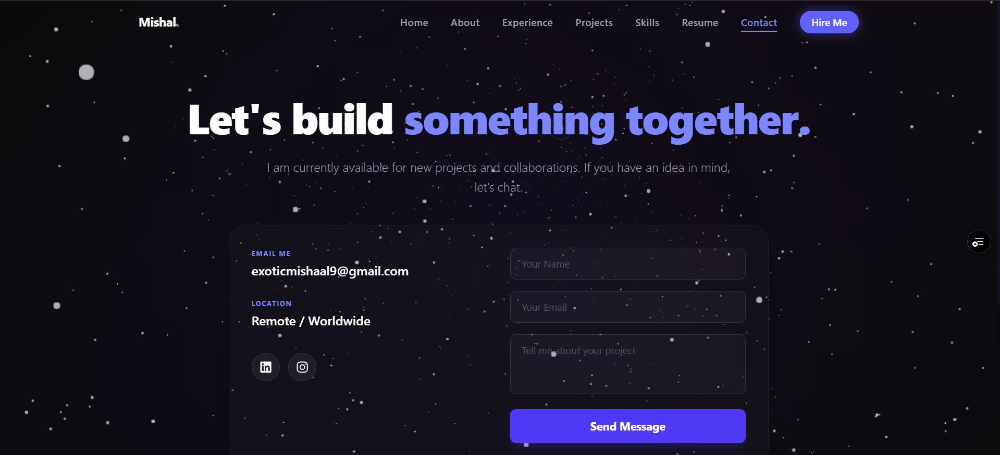

<h1 align="center">🌌 My Portfoli0</h1>

<p align="center">
  A modern, responsive and animated personal portfolio built with Next.js.
</p>

<p align="center">
  <a href="https://my-portfolio-srff.vercel.app/" target="_blank">
    
  </a>
  <a href="https://github.com/Mishal04/MY_PORTFOLIO">
    
  </a>
</p>

---

# 🌐 Live Website

### 🔗 https://my-portfolio-srff.vercel.app/

---

# 📖 About

This is my personal developer portfolio showcasing my skills, projects, experience and technical journey.

The portfolio is designed with a modern space-inspired UI, smooth animations and fully responsive layouts to deliver an engaging user experience.

---

# ✨ Features

- 🌌 Modern Space UI
- ⚡ Built with Next.js
- 📱 Fully Responsive
- 🎨 Beautiful Animations
- 💼 Featured Projects
- 👩 About Me Section
- 🛠 Technical Skills
- 📄 Resume Download
- 📬 Contact Form
- 🌙 Dark Theme

---

# 🛠 Tech Stack

- Next.js
- React.js
- TypeScript
- Tailwind CSS
- Framer Motion
- GSAP
- Three.js
- Firebase
- EmailJS
- Vercel

---

# 📸 Screenshots

## 🏠 Home



---

## 🚀 Projectsss



---

## 📩 Contact




---

# 🚀 Installation

```bash
git clone https://github.com/Mishal04/MY_PORTFOLIO.git

cd MY_PORTFOLIO

npm install

npm run dev
```

---

# 📂 Folder Structure

```
MY_PORTFOLIO
│
├── app
├── components
├── assets
│   └── screenshots
├── public
├── styles
├── package.json
└── README.md
```

---

# 👩 Developer

### Mishal Ashfaq

Full Stack (MERN) Developer

- React.js
- Next.js
- Node.js
- Express.js
- MongoDB
- Firebase

---

# 📫 Contact

Email

```
exoticmishaal9@gmail.com
```

Portfolio

```
https://my-portfolio-srff.vercel.app/
```

LinkedIn

```
https://linkedin.com/in/mishal-ashfaq-503237332
```

GitHub

```
https://github.com/Mishal04
```

---

# ⭐ Support

If you like this project, don't forget to ⭐ the repository.
